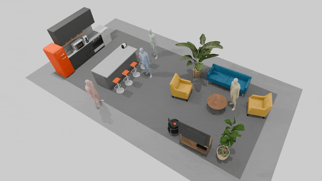
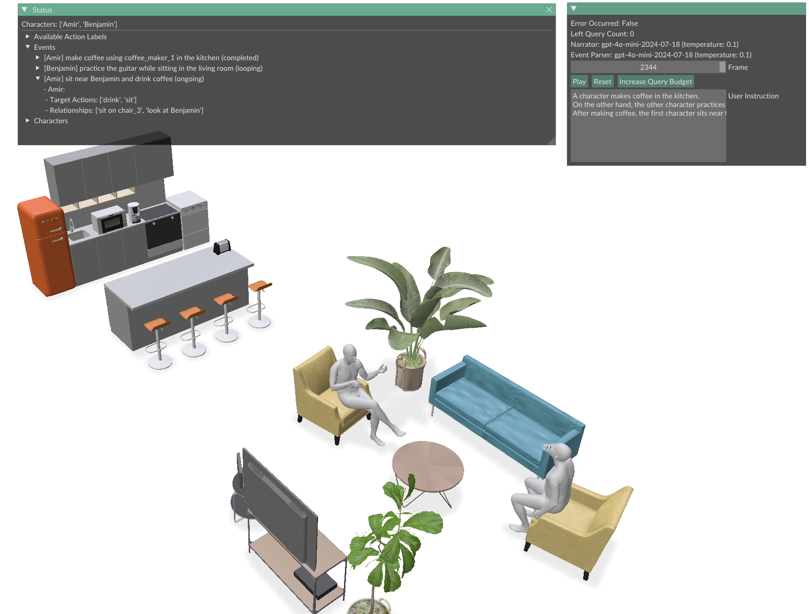

# Event-Driven-Storytelling
[](https://rms0329.github.io/Event-Driven-Storytelling/)
[](https://www.arxiv.org/abs/2507.19232)

<p>
    Official Repository of Event-Driven Storytelling with Multiple Lifelike Humans in a 3D Scene<br>
    <b>(Accepted on ICCV 2025)</b>
</p>

<p align="center">
    
</p>

<p>
    <b>TL;DR:</b> Our framework creates behavioral plans and corresponding motions for multiple characters, taking into account the 3D scene and the behaviors of other characters within it.
</p>

## Pre-requisites
※ Our code was developed and tested on Ubuntu 22.04 LTS with Python 3.10 and CUDA 11.8.

### Environment Setup
Our code manages dependencies using [uv](https://docs.astral.sh/uv/). You can install it from the [uv installation guide](https://docs.astral.sh/uv/getting-started/installation/).\
In case you are using a CUDA version other than 11.8, you may need to modify the `pyproject.toml` file.
- Find the `[[tool.uv.index]]` section with `name = "pytorch-cuda"`, and update the `url` to correspond to your CUDA version.
- For example, if you are using CUDA 12.1, change the URL to:
    ```toml
    url = "https://download.pytorch.org/whl/cu121"
    ```
After above steps, run the following command to create a virtual environment and install the required dependencies:
```bash
uv sync  # create a virtual environment and install dependencies to .venv folder
```

### API Keys for Language Models
Running our code requires API keys for language models.\
To set up the API keys as environment variables, create a `.env` file in the project root directory and add your keys in it. For example, in case of [OpenAI's API](https://platform.openai.com/account/api-keys):
```ini
# in your .env file
OPENAI_API_KEY=your_openai_api_key_here
...
```

### HSSD Dataset for Our Test Scenes
To run our benchmark or demo, you need to prepare the [HSSD dataset](https://3dlg-hcvc.github.io/hssd/), from which the objects in our test scenes are derived.\
We provide a script to download only the 3D models that are used in our test scenes. You can follow these steps to download the models:
- Write your [Hugging Face access token](https://huggingface.co/settings/token) to the `.env` file. Your token should have permission to read public repositories.
    ```ini
    # in your .env file
    HUGGINGFACE_HUB_TOKEN=your_token_here
    OPENAI_API_KEY=... # other keys
    ...
    ```
- Run the following command to download the 3D models:
    ```bash
    # download the 3D models
    uv run -m scripts.download_hssd
    ```
After downloading, the 3D models of HSSD dataset should be organized as follows:
```
${PROJECT_ROOT}$
    ├── data/
    │    ├── HSSD/
    │    │    └── objects/
    │    │        ├── 0/
    │    │        ├── 1/
    │    │        ├── 2/
    │    │        └── ...
    │    └── ...
    └── ...
```

### Motion Datasets (only when running the demo)
To run the demo, you need to download the motion datasets used in our motion matching implementation.
- [AMASS](https://amass.is.tue.mpg.de/): locomotion and other activities (e.g., drink, type_keyboard, etc.)
- [SAMP](https://samp.is.tue.mpg.de/): human-scene interaction motions (e.g., sit)
- [Inter-X](https://liangxuy.github.io/inter-x/): human-human interaction motions (e.g., chat, hug, etc.)

Our demo with default settings requires only the AMASS and SAMP datasets, but you need to download the Inter-X dataset to enable the human-human interaction motions. After downloading each dataset, you should organize them in the following structure:
```
${PROJECT_ROOT}$/
    ├── data/
    │   ├── AMASS/
    │   │   └── SMPL-H-G/
    │   │       ├── ACCAD/
    │   │       ├── BMLhandball/
    │   │       └── ...
    │   ├── SAMP/
    │   │   └── pkl/
    │   │       ├── armchair_stageII.pkl
    │   │       ├── armchair001_stageII.pkl
    │   │       └── ...
    │   └── Inter-X/ (optional)
    │       ├── motions/
    │       ├── annots/
    │       └── ...
    └── ...
```

## Running the Code
### Demo
<p align="left">
    
</p>

To run our demo with our default settings, you can simply run the following command:
```bash
uv run -m main
```
You can also run the demo with several configurations changed. For example, to run the demo with a different scene and number of characters, you can use:
```bash
uv run -m main scene_name=<SCENE_NAME> num_characters=<NUM_CHARACTERS>
```
Replace `<SCENE_NAME>` with the name of the scene you want to run (e.g., `House`, `Office`,  `Restaurant`), and `<NUM_CHARACTERS>` with the number of characters you want to simulate in the scene.

#### Note
We use a very simple motion matching / path planning implementation in our demo, which may not work well in various corner cases. If a character gets stuck or LLM fails to generate a proper plan, you can reset the scene using the `Reset` button.


### Benchmark
To run our benchmark, you can use the following command:
```bash
uv run -m scripts.run_benchmark
```
This scipt will ask you to select test cases and several configurations to run the benchmark.
- To reproduce the result of Table 1. in our paper, select the following options:
    - Repeat Count: `5`
    - Test Cases: `OA, RC, SS`
    - Test Types: `0-3`
    - Distraction Levels: `0-2`
- To reproduce the result of Table 2. in our paper, select the following options:
    - Repeat Count: `5`
    - Test Cases: `PI`
    - Test Types: `3,4`
    - Distraction Levels: `0`
    

## Contact
If you have any questions, please email `rms2836@snu.ac.kr`.